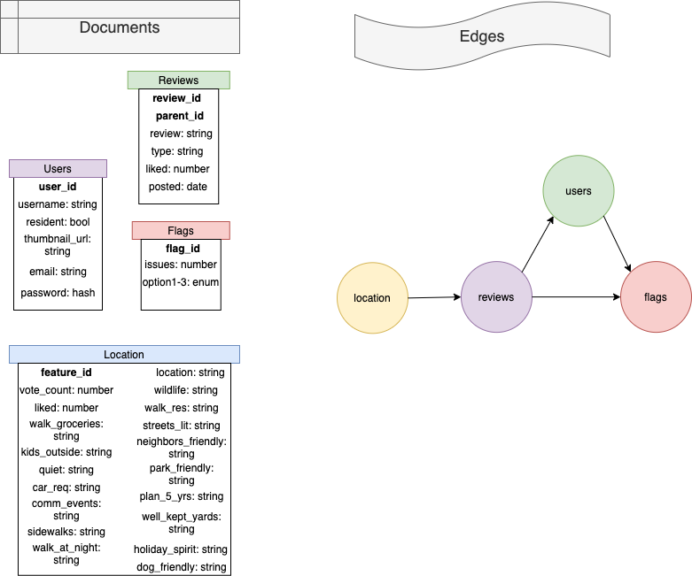

# Local Review
---

>This is local-review component of Trulia.com real estate application. It displays the reviews of local neighbors for the property. Also you can see the current ratings of features and expand the view to see more.

## Related Projects

  - https://github.com/Archon-Design/AffordabilityCalculator
  - https://github.com/Archon-Design/similar-homes-service
  - https://github.com/Archon-Design/PhotoGallery

## Table of Contents

1. [Usage](#Usage)
1. [Requirements](#requirements)
1. [Development](#development)

## Usage

> to get started, run `npm install` then `npm start`

## Requirements

An `nvmrc` file is included if using [nvm](https://github.com/creationix/nvm).

- Node 6.13.0
- etc

## Development

### Installing Dependencies

From within the root directory:

```sh
npm install -g webpack
npm install
```

# API


## Reviews


### Get a singular review

- GET `/api/reviews/:{id}`


#### Path Parameters:

- `review_id` | review ID


#### Success Status Code: `200`

Returns: JSON

```
{
  "review_id": "Integer",
  "parent_id": "Integer",
  "review": "String",
  "type": "String",
  "liked": "Integer",
  "posted": "Date",
}
```


### Post a review

- POST `/api/reviews/`


#### Path Parameters:

- none


#### Success Status Code: `200`


Returns: success


### Update message on a review

- PUT `/api/reviews/:{id}`


#### Path Parameters:

- `review_id` | Review ID


#### Success Status Code: `200`


Returns: success


### Delete specific review

- DEL `api/reviews/:{id}`

#### Path parameters:

- `review_id` | Review ID


#### Success Status Code: `200`


Returns: success


## Users


### Get a singular user

- GET `/api/reviews/:{id}`


#### Path Parameters:

- `user_id` | user ID


#### Success Status Code: `200`

Returns: JSON

```
{
  "username": "string",
  "resident": "bool",
  "thumbnail_url": "string",
  "email": "string",
  "password": "hash"
}
```


### Post a user

- POST `/api/users/`


#### Path Parameters:

- none


#### Success Status Code: `200`


Returns: success


### Update message on a user

- PUT `/api/users/:{id}`


#### Path Parameters:

- `user_id` | user ID


#### Success Status Code: `200`


Returns: success


### Delete specific user

- DEL `api/users/:{id}`

#### Path parameters:

- `user_id` | user ID


#### Success Status Code: `200`


Returns: success


## Flags


### Get count of flags at an option at a review id.

- GET `/api/flags/:{id}/{flag_option}`


#### Path Parameters:

- `review_id` | review ID
- `flag_option` | flag option string


#### Success Status Code: `200`

Returns: JSON

```
{
  "flags_count": "number",
  "user": "string",
}
```


## Locations


### Get all features of a location

- GET `/api/locations/:{id}`


#### Path Parameters:

- `location_id` | location ID


#### Success Status Code: `200`

Returns: JSON

```
{
  "walk_groceries": "number",
  "kids_outside": "number",
  "quiet": "number",
  "car_req": "number",
  "comm_events": "number",
  "sidewalks": "number",
  "walk_at_night": "number",
  "wildlife": "number",
  "walk_res": "number",
  "streets_lit": "number",
  "neighbors_friendly": "number",
  "park_friendly": "number",
  "plan_5_yrs": "number",
  "well_kept_yards": "number",
  "holiday_spirit": "number",
  "dog_friendly": "number",
}
```


### Update a number on a feature

- PUT `/api/locations/:{location_id}/:{user_id}/{location_feature}`


#### Path Parameters:

- `location_id` | location ID

- `user_id` | user ID

- `location_feature` | individual feature


#### Success Status Code: `200`


Returns: success


# Schema



